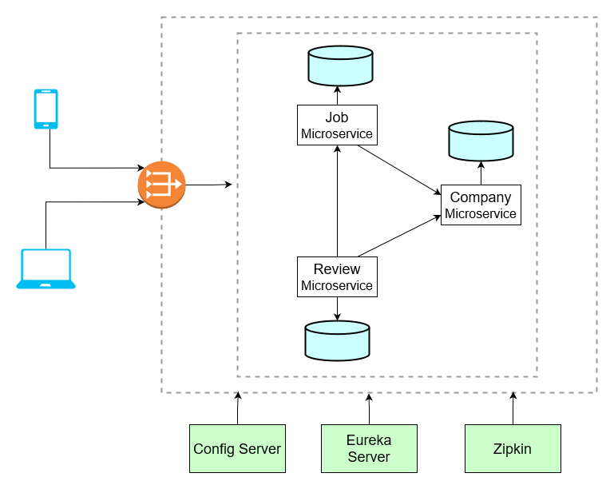

# Job Portal using Spring Boot

## Overview

This project is a basic implementation of a job portal using a microservices architecture. The system consists of several microservices, each handling different aspects of the job portal, including job postings, companies, and company reviews. This README provides an overview of the entire system and links to the individual microservices repositories for more detailed information.

## Microservices

The job portal is composed of the following microservices and repositories:

| Service            | Description                                                                                       | Repository URL |
|--------------------|---------------------------------------------------------------------------------------------------|----------------|
| Jobs Service       | Manages job postings, including creating, updating, deleting, and retrieving job listings.        | [Jobs Service Repo](https://github.com/kumarrohit26/job-microservice.git)  |
| Companies Service  | Manages company information, including creating, updating, deleting, and retrieving company data. | [Companies Service Repo](https://github.com/kumarrohit26/company-microservice.git)  |
| Reviews Service    | Manages reviews for companies, including creating, updating, deleting, and retrieving reviews.    | [Reviews Service Repo](https://github.com/kumarrohit26/review-microservice.git)  |
| Service Registry   | Implements service discovery using Spring Cloud Eureka for dynamic service registration.          | [Service Registry Repo](https://github.com/kumarrohit26/service-registry.git)  |
| API Gateway        | Uses Spring Cloud Gateway to route requests to the appropriate microservice.                      | [API Gateway Repo](https://github.com/kumarrohit26/api-gateway.git)  |
| Config Server      | Centralized configuration management for all microservices using Spring Cloud Config.             | [Config Server Repo](https://github.com/kumarrohit26/config-server.git)  |
| Application Configuration Repo | Stores configuration properties for different environments.                                       | [Configuration Repo](https://github.com/kumarrohit26/application-config.git)  |

## Architecture



The system follows a microservices architecture, where each microservice is responsible for a specific domain of the job portal. Here is a brief description of each service:

### Jobs Service
The Jobs Service handles all operations related to job postings. It provides RESTful APIs to create, update, delete, and retrieve job listings.

### Companies Service
The Companies Service manages company-related information. It provides APIs to manage company profiles and details.

### Reviews Service
The Reviews Service is responsible for managing company reviews. It includes functionalities to add, update, delete, and fetch reviews for companies.

### Service Registry
The Service Registry uses Spring Cloud Eureka for service discovery. It allows microservices to register themselves at runtime and to discover other registered services.

### API Gateway
The API Gateway uses Spring Cloud Gateway to route requests to the appropriate microservice. It acts as a single entry point for all client requests.

### Config Server
The Config Server provides centralized configuration management for all microservices. It retrieves configuration properties from the [Configuration Repository](https://github.com/kumarrohit26/application-config.git).

### Configuration Repository
This repository contains the configuration properties for different environments. The Config Server fetches these properties to configure the microservices accordingly.

## Tools and Technologies

This project utilizes several tools and technologies to enhance the functionality and reliability of the system:

- **PostgreSQL:** Used as the database for all microservices.
- **Docker:** Used to run PostgreSQL, pgAdmin, and Zipkin in containers.
- **Distributed Tracing:** Using Zipkin and Micrometer for tracing and monitoring requests across microservices.
- **OpenFeign:** For declarative REST client to simplify HTTP communication between microservices.
- **Fault Tolerance and Circuit Breaker:** Implemented using Resilience4j to handle failures gracefully and ensure system resilience.

## Getting Started

To use this repository, please follow these steps:

1. Download all the microservices using the `download.sh` file.
2. Open each project in IntelliJ as a Maven project.
3. You might need to set some `.env` files in some microservices; details of which are mentioned in the respective repository.

To bring up the Docker instances for PostgreSQL, pgAdmin, and Zipkin, run the following command from the directory where the `docker-compose.yml` file is present:

```sh
docker compose up -d
```

The following Docker containers are used in this project:

| Service   | Container Name     | Image                | Host Port | Container Port |
|-----------|---------------------|----------------------|-----------|----------------|
| Postgres  | postgres_container  | postgres             | 5000      | 5432           |
| pgAdmin   | pgadmin_container   | dpage/pgadmin4       | 5050      | 80             |
| Zipkin    | zipkin_container    | openzipkin/zipkin    | 9411      | 9411           |

## Running the Application
Run the applications in the following order:

|Service Name	|Port	|Gateway URL|
|---------------|-------|-----------|
|Service Registry|	8761|	http://localhost:8085/eureka/main|
Config Server	|8080	|N/A|
API Gateway	|8085	|N/A|
Job Microservice	|8082	|http://localhost:8085/jobs|
Company Microservice	|8083	|http://localhost:8085/companies|
Review Microservice	|8084	|http://localhost:8085/reviews|

- **Service Registry:** Accessible on localhost:8761 or via the API Gateway.
- **Config Server:** Accessible on localhost:8080.
- **API Gateway:** Accessible on localhost:8085.
- **Job Microservice:** Accessible on localhost:8082 or via the API Gateway at /jobs.
- **Company Microservice:** Accessible on localhost:8083 or via the API Gateway at /companies.
- **Review Microservice:** Accessible on localhost:8084 or via the API Gateway at /reviews.
